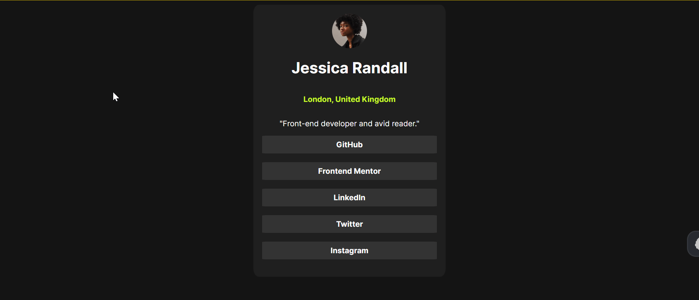

# Frontend Mentor - Social links profile solution

This is a solution to the [Social links profile challenge on Frontend Mentor](https://www.frontendmentor.io/challenges/social-links-profile-UG32l9m6dQ).

## Table of contents

- [Overview](#overview)
  - [The challenge](#the-challenge)
  - [Screenshot](#screenshot)
  - [Links](#links)
- [My process](#my-process)
  - [Built with](#built-with)
  - [What I learned](#what-i-learned)
  - [Continued development](#continued-development)
- [Author](#author)

**Note: Delete this note and update the table of contents based on what sections you keep.**

## Overview

### The challenge

Users should be able to:

- See hover and focus states for all interactive elements on the page

### Screenshot

### Links

- Solution URL: [Github link](https://github.com/snigdha-sukun/social-links-profile)
- Live Site URL: [Social links profile](https://social-links-profile-zeta-peach.vercel.app/)

## My process

### Built with

- Semantic HTML5 markup
- CSS

### What I learned

I learned that `align-items` & `justify-content` only work for `display: flex`

I learned to use `rem` for sizing instead of `5` everywhere.

I learned that `padding` also helps with getting the required size.

### Continued development

I still need to practice the positioning an element more. I also need to learn about CSS in general & HTML5 rules.

## Author

- Frontend Mentor - [@snigdha-sukun](https://www.frontendmentor.io/profile/snigdha-sukun)
